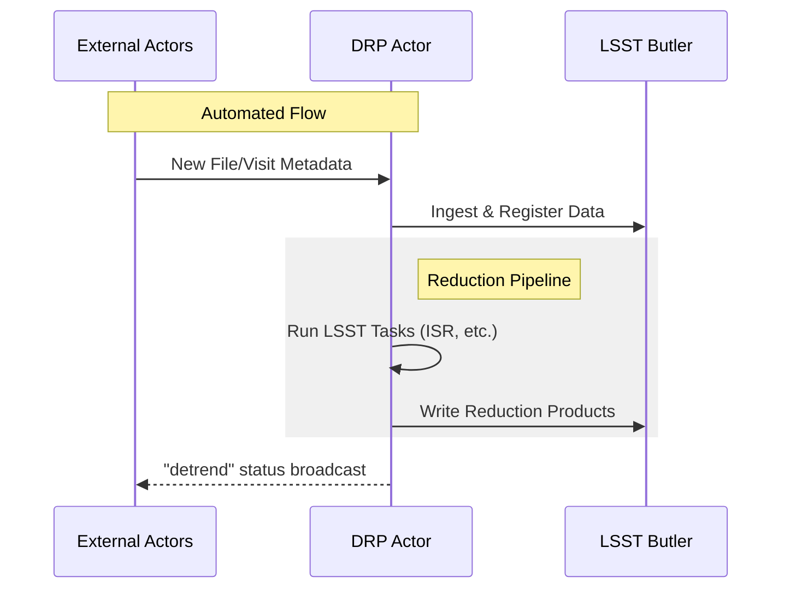

# ics_drpActor

Data Reduction Pipeline (DRP) Actor for the Prime Focus Spectrograph (PFS).

## Information Flow Diagram

The following diagram illustrates the automated information flow within the `drpActor`. It shows how messages from other actors (like CCD controllers, Sps, and IIC) trigger ingestion and reduction processes.

## System Overview

1.  **Actor Initialization**: The `DrpActor` starts and connects to the Hub. It subscribes to keywords from `ccd`, `hx`, `sps`, and `iic` models.
2.  **New Exposure/Config**: When a new raw file (CCD or HX) or a `pfsConfig` file is produced, the actor is notified via callbacks. It creates `CCDFile`, `HxFile`, or `PfsConfigFile` objects and registers them in the `DrpEngine`.
3.  **Visit Processing**: The `sps.fileIds` keyword signals that a visit is ready for processing. The `DrpEngine`:
    *   **Ingests** the raw files and the `pfsConfig` into the LSST Butler repository.
    *   **Reduces** the data using the LSST Science Pipelines (if `doAutoReduce` is enabled).
4.  **Group Reduction**: When an IIC sequence finishes, the `iic.sequence` callback triggers a group reduction for all visits associated with that sequence.
5.  **Output**: Reduction products are stored in the Butler datastore. If enabled, the actor broadcasts `detrend` messages when post-ISR images are generated.

## Manual Commands

*   `ingest visit=...`: Manually ingest specific visits.
*   `reduce where=...`: Manually trigger reduction for specific datasets.
*   `startDotRoach`: Start the "DotRoach" loop for engineering/calibration.
